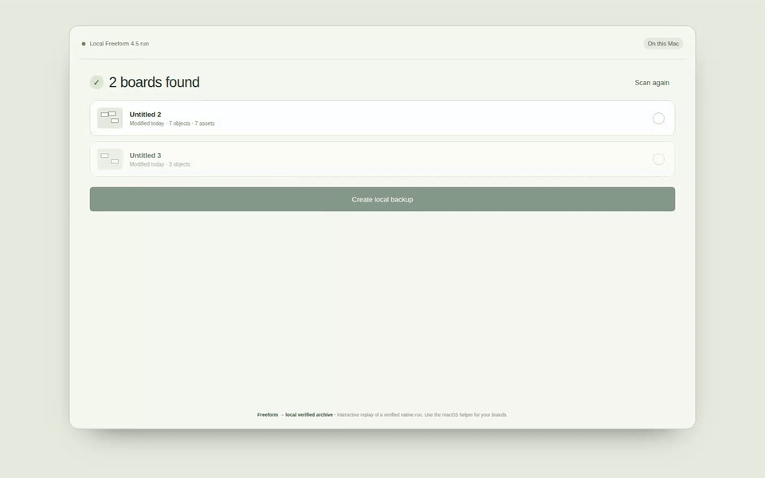

# BoardEject

**Your board. Your format.**

Export Apple Freeform boards to editable Excalidraw files or preserve a selected board in a verified local archive. Both workflows stay on your device.

An editable escape route, not another whiteboard. No account, no board uploads, no cloud storage.

[Export to Excalidraw](https://boardeject.dev/#export) · **[Archive a Freeform board](https://boardeject.dev/#archive)**

[Download the Mac helper](https://boardeject.dev/mac-helper) · [Test your capture](https://boardeject.dev/test-capture) · [Try the sample file](examples/example.excalidraw)


_Genuine Freeform 4.5 selection → localhost Mac helper → editable Excalidraw text._

[Watch MP4](docs/demo.mp4) · [MIT license](LICENSE)

- **Keep editing:** supported content becomes movable shapes, editable text and table cells. Supported decoded connectors stay bound.
- **Keep your board private:** processing happens in your browser, with no account, board uploads or cloud storage.
- **Know what transferred:** preview the result and review partial or unsupported elements before downloading.

Support varies by Freeform version and object type. Keep your original board; see [Current status](#current-status) before importing real work.

## How it works

BoardEject has two separate local-first workflows:

### Editable Export

Freeform clipboard → editable Excalidraw.

1. Copy your objects in Apple Freeform.
2. Click **Import copied selection** on BoardEject. The [Mac helper](https://boardeject.dev/mac-helper) reads the current Freeform clipboard only after this action.
3. Inspect the conversion report and preview the result.
4. Download your editable `.excalidraw` file.

### Local Freeform Archive



_Genuine Freeform 4.5 data → packaged localhost Mac helper → selected-board archive → integrity verification._

[Watch archive MP4](docs/archive-demo.mp4) · [Setup and usage](docs/guide.md)

Freeform database → portable `.boardejectarchive` containing only the selected board's native records, original referenced assets, verified metadata, hashes and integrity information.

1. **Scan Freeform.**
2. Choose a board.
3. **Create archive** and save the `.boardejectarchive` file.
4. **Verify archive** to see the board name, object and asset counts, checked files, missing or corrupted files, and final integrity status.

BoardEject never modifies the live Freeform database and does not upload board or archive data. Restore or write-back into Apple Freeform is not supported. See the [BoardEject guide](docs/guide.md) for setup, commands, safety boundaries, and the verified Freeform-version boundary.

No Mac handy? Choose **Try example board** on the website to explore editable output, or use [Capture Tester](https://boardeject.dev/test-capture) with an existing capture.

## Import from Freeform

Apple Freeform → select objects → Cmd+C → BoardEject → editable Excalidraw.

Browsers cannot reliably read Apple's private clipboard types. After an explicit click on **Import copied selection**, the authenticated localhost [macOS helper](docs/guide.md) reads one stable pasteboard snapshot and returns the existing versioned capture envelope to BoardEject in the same browser. Conversion still runs locally through the verified parser and converter. PDF is not supported input.

The normal flow does not save an intermediate capture file. Existing `.boardeject` files remain supported through **Capture-file fallback** and the [Capture Tester](https://boardeject.dev/test-capture) for development, diagnostics, and recovery.

The helper compiles and passes its command-line smoke check in clean macOS CI. Real Freeform 4.5 GUI captures on hosted macOS validate the listed conversion subsets, not every Freeform object or version. Unsupported structures are withheld instead of producing misleading exports.

## Test your own capture

Open [Experimental Capture Tester](https://boardeject.dev/test-capture) and choose/drop a `.boardeject` capture (or its JSON envelope). Single `.crlnative` and `.drawing` payloads are also accepted, but lack companion assets. Processing stays in your browser. Review detected/converted counts and diagnostics, preview recovered output and download `.excalidraw`. Unsupported or malformed captures do not get substituted with an example. Normal import remains unchanged.

Run `python3 scripts/capture_browser_check.py` against the preview server to exercise file selection, drop, failed input, preview and download. Set `BOARDEJECT_TEST_URL` to check a deployed site with the same public test fixtures.

## Current status

### Editable Export status

Supported fixture-backed shapes, text, tables, assets, ink, and connectors are converted to editable Excalidraw elements. Freeform 4.5 version-7 boards are supported only through the specific native paths listed in the matrix below.

### Archive status

**v0.0.4 provides a website-driven Local Freeform Archive for the exact verified Freeform 4.5 schema alongside direct clipboard export through the Mac helper.** The export demo uses a genuine supported Freeform 4.5 text selection; it does not imply support for every object. Freeform 4.5 version-7 data is not generally supported. Only the fixture-backed table, single-object, nested-group and connector sidecar fallbacks described below are recovered. See the [support matrix](#support-matrix) and [fidelity report](docs/fidelity.md) before importing real work.

## Known limitations

- Arbitrary version-7 boards remain unsupported. Connector recovery is limited to the verified two-shape center-anchor sidecar, and nested transforms are limited to the verified unflipped translation, uniform-scale and rotation sidecars.
- Mixed styles and exact fonts remain metadata; image shadow blur and some table edges/padding are approximations.
- iPad-originated Apple Pencil pressure and erased-ink round trips remain unverified in [#20](https://github.com/royalpinto007/boardeject/issues/20).
- PDF is not supported input. Raw clipboard payloads may lack companion assets.
- Archive restore/write-back and iCloud manipulation are not supported. Archive creation accepts only the exact verified Freeform 4.5 schema and fails closed for unknown versions or structural fingerprints.
- Database-native archive records are not reconstructed into an unverified clipboard payload. An optional Excalidraw file is included only when a verified conversion path supplies it; the current database archive path does not produce one.

The matrix below specifies each tested boundary, including the native evidence and links to remaining work.

### Mac helper status

The helper ships as a [Universal Mac DMG](https://downloads.boardeject.dev/BoardEject-macOS-universal.dmg), with a ZIP fallback. Drag it to Applications, complete the documented [Gatekeeper approval](docs/guide.md#install-the-mac-helper) once, and boardeject.dev retries its localhost-only connection automatically. The browser explains Local Network Access before connecting. You can then scan Freeform, create the selected-board archive, and verify it without terminal commands. Optional Launch at Login is available from the menu-bar helper; the CLI remains a developer fallback. The app is ad-hoc signed but not Apple-notarized.

## Support matrix

**Table update:** verified native layouts now preserve unequal dimensions, structure changes, ordering, text styles/alignment, solid colors, border properties, multiple tables, and attached text boxes as editable output. Merge and rotation are unavailable for tables in the tested Freeform version. See [fidelity evidence](docs/fidelity.md).

Native capture evidence and working end-to-end conversion are different things. Keep your original board and inspect the conversion report.

### Native image and rich-text boundary

| Native capture | Tested output and limits |
| --- | --- |
| Image with verified mask/shadow | Original PNG resource and Bézier mask preserved in an embedded SVG image. Downward shadow offset/color/opacity retained; blur is approximate. Effects are part of the image asset, not editable effect controls. Other crop/transform variants remain unsupported. |
| Plain/bold/mixed text | One editable text element with decoded first-run size/alignment. Original run boundaries, font names, bold/italic and sizes remain in metadata. Mixed styling and exact fonts are not visually preserved; wrapping, padding and color use defaults. |

These paths require the complete capture sidecars, not standalone CRL. They do not enable arbitrary version-7 boards. [Issue #14](https://github.com/royalpinto007/boardeject/issues/14) records the completed implementation and destination-format limits.

| Capability | v0.0.4 evidence and boundary |
| --- | --- |
| Editable Excalidraw output | Browser-tested shape movement, following bound arrows and text editing. The public export demo imports a genuine supported Freeform 4.5 text selection through the packaged helper. |
| Shapes and text | Explicit preset mapping and recovered plain text on supported decoded inputs. Verified single-object plain, mixed and multiline native text remains editable with first-run size/alignment. Genuine `Source` and `Target` labels remain editable and grouped with their connected shapes. Native run boundaries, font names, sizes, bold and italic descriptors are retained in metadata. Excalidraw cannot visually render mixed weight/italic runs. [#14](https://github.com/royalpinto007/boardeject/issues/14). |
| Connectors | Genuine unlabelled and labelled two-shape Freeform 4.5 captures map native center-anchor UUIDs to unique shape centers and produce reciprocal Excalidraw bindings without array-order correlation. Production `/test-capture` checks move a captured shape, confirm its arrow follows, and edit its label. Other routing, arrowhead and multi-object variants remain unsupported. |
| Groups/transforms | Genuine Freeform 4.5 translation, uniform-scale and rotation differentials preserve canvas-space leaf geometry and deepest-first editable groups. The verified fallback accepts unflipped placeholder shapes only; labels, flips, shear and unknown hierarchies fail closed. Native supported-version group membership still rejects unvalidated counter transforms. [#8](https://github.com/royalpinto007/boardeject/issues/8). |
| Splines and ink | Centerline spline endpoints match 25 Apple PencilKit reference samples. Supported decoded ink produces freedraw output. Genuine Freeform 4.5 macOS evidence identifies Draw with Pen output as `CRLWPShapeItem` vector shapes, with no `com.apple.drawing` or `CRLFreehandDrawingItem`. |
| Width/force decoding and mask safety | Apple-generated width/force data decoding has regression coverage. The tested geometric mask is detected and the stroke omitted with a report, rather than incorrectly restoring hidden ink. Output remains a uniform-width approximation. |
| Pressure-sensitive / erased ink | **iPad-originated Apple Pencil pressure and erased-ink round trips remain unverified.** Freeform 4.5 on macOS exposes neither PencilKit ink output nor an eraser in the tested flow. Apple framework fixtures validate decoding, not a Freeform round trip. Follow [#20](https://github.com/royalpinto007/boardeject/issues/20). |
| Images/assets | Verified single-object native PNG resources retain original pixels and the captured Bézier mask in an editable/movable SVG image asset. Captured shadow offset/color/opacity are retained; blur is calibrated but approximate. Effects are not independent Excalidraw controls. Other resources, crops/transforms and shadow variants remain unsupported. [#14](https://github.com/royalpinto007/boardeject/issues/14). |
| Tables | **Verified subset:** editable cell IDs/text, unequal dimensions, insert/delete/reorder, multiline/empty content, font metadata/alignment, solid text/background colors, border visibility/width/color/solid-or-dotted style, multiple tables, and attached text boxes. Outer-only edges and attachment padding are approximated. Freeform 4.5 exposes no table merge or rotation operation; other attachment classes fail safely. [#15](https://github.com/royalpinto007/boardeject/issues/15). |
| Reporting and privacy | Unsupported elements/versions reported; no fabricated replacement output. Browser processing, no accounts, board uploads or cloud storage. |
| Freeform version compatibility | Compatible native versions reported by libfreeform use the normal adapter. Genuine Freeform 4.5 captures declare minimum version 7, which is not generally supported. Only verified table, single-object image/text, nested-group and two-shape connector sidecar fallbacks are recovered; other version-7 structures are withheld. Genuine Freeform 2.4 captures use the recognized legacy `CRLDescription` flavor but omit the sidecars/assets required for faithful conversion, so they remain fail-closed. Cross-version validation remains [#6](https://github.com/royalpinto007/boardeject/issues/6). |
| Local Archive | Freeform 4.5 schema version 16 with fingerprint `921b22ba…f433` supports verified board discovery, strict title decoding with UUID fallback, selected-board-only extraction, original image/PDF/video/file preservation, deterministic archives and independent integrity verification. Unknown schemas fail closed. No restore or database-native Excalidraw conversion. |

See [fidelity and native evidence](docs/fidelity.md), [privacy](https://boardeject.dev/privacy) and [terms](https://boardeject.dev/terms).

## Architecture

`apps/mac-helper` captures Apple's private pasteboard flavors. `packages/freeform-parser` decodes them using libfreeform's Rust/WebAssembly parser. `packages/board-model` defines a format-independent intermediate model. `packages/excalidraw-converter` produces editable elements. `apps/web` handles import, reporting and download.

No accounts, board uploads, backend, or cloud persistence. The official Excalidraw component will open exports locally, not through a sharing service. Unsupported content is reported, never silently counted as a successful conversion.

## Run locally

Requires Node 22.12 or newer.

```sh
npm ci
npm run dev
```

Open http://127.0.0.1:5190 and choose **Try example board**. Open the result in Excalidraw, move a card, and edit the text. Download to keep your changes.

### Checks

```sh
npm run format:check
npm run lint
npm run typecheck
npm test
npm run build
npm run preview
# In another terminal:
python3 scripts/browser_check.py
```

Browser checks require Python Playwright and Google Chrome. They verify shape movement, a following bound arrow, text editing, responsive layout and zero external requests during the tested flow.

## Demo

The public export MP4/GIF is a real browser recording generated by `scripts/record_export_demo.py` during the genuine macOS Freeform workflow. It shows the website importing a copied native selection through the packaged localhost helper, opening the result in Excalidraw, and editing its text. The separate `npm run demo` command remains available for the synthetic converter regression demo.

## Roadmap

- Extend **Local Freeform Archive** only when additional Freeform database schemas have genuine native validation. See the [safety boundary](docs/guide.md) and stable [archive format](docs/archive-format.md).
- Extend the verified connector and nested-group sidecars beyond the current bounded subsets.
- Validate Freeform clipboard captures across additional macOS versions.
- Validate iPad-originated Apple Pencil pressure and erasure in [#20](https://github.com/royalpinto007/boardeject/issues/20).
- Sign and notarize the Universal Mac helper for a smoother first install.

v0.0.4 freezes the verified scope above, not the remaining fidelity work. Contributions and non-sensitive native test captures are welcome.

**Creates a local, verifiable archive of your Freeform board and original assets. Restore back into Apple Freeform is not supported yet.**

## Contributing and credits

[Help with open issues](https://github.com/royalpinto007/boardeject/issues) · [Buy me a coffee](https://www.buymeacoffee.com/royalpinto007)

Read [CONTRIBUTING.md](CONTRIBUTING.md) and [SECURITY.md](SECURITY.md). Built on [libfreeform](https://github.com/can1357/libfreeform) and [Excalidraw](https://github.com/excalidraw/excalidraw). BoardEject is independent of Apple and Excalidraw. Third-party code and fonts retain their original licenses.
