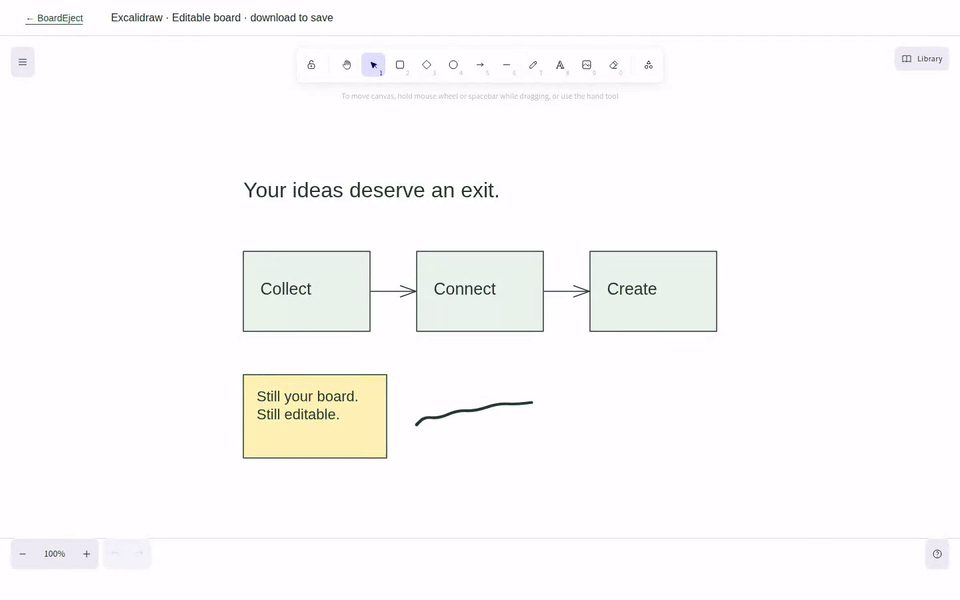

# BoardEject

**Your board. Your format.**

[Try BoardEject](https://boardeject.dev) · [Help with open issues](https://github.com/royalpinto007/boardeject/issues)

[Buy me a coffee](https://www.buymeacoffee.com/royalpinto007)

Turn Apple Freeform boards into editable Excalidraw files.

An editable escape route, not another whiteboard. No account, no board uploads,
no cloud storage.



**v0.0.1 is an early, limited-scope release:** this recording uses a synthetic example to demonstrate
editable output, not a complete Freeform import. Version-7 boards are rejected
except for the verified single-table recovery described below. See the support matrix and
[fidelity report](docs/fidelity.md) before importing real work.

[Watch MP4](docs/demo.mp4) · [Try the sample file](examples/example.excalidraw) ·
[MIT license](LICENSE)

## Development

Requires Node 22.12 or newer.

```sh
npm ci
npm run dev
```

Open http://127.0.0.1:5190 and choose **Try example board**. Open the result in
Excalidraw, move a card, and edit the text. Download to keep your changes.

## Import from Freeform

Apple Freeform → select objects → Cmd+C → capture → BoardEject → Excalidraw.

Browsers cannot reliably read Apple's private clipboard types. The tiny
[macOS helper](docs/clipboard.md) saves a `.boardeject` capture for the file picker.
The clipboard button accepts that same envelope copied as text. It does not
claim direct access to private pasteboard formats. PDF is not supported input.

The helper compiles in macOS CI. Real Freeform GUI captures on hosted macOS
validate the presence of native content, not every conversion path. Captures
with unsupported native versions are rejected instead of producing misleading exports.

## Test your own capture

Open [Experimental Capture Tester](https://boardeject.dev/test-capture) and
choose/drop a `.boardeject` capture (or its JSON envelope). Single `.crlnative`
and `.drawing` payloads are also accepted, but lack companion assets. Processing
stays in your browser. Review detected/converted counts and diagnostics, preview
recovered output and download `.excalidraw`. Unsupported or malformed captures
do not get substituted with an example. Normal import remains unchanged.

Run `python3 scripts/capture_browser_check.py` against the preview server to
exercise file selection, drop, failed input, preview and download. Set
`BOARDEJECT_TEST_URL` to check a deployed site with the same public test fixtures.

## Support matrix

**Table update:** native baseline, cell changes/restores and a translated table
now export four editable cells plus text. Geometry and cell-ID mapping are
verified for this layout; formatting uses defaults. Other table variants remain
partial. See [mapping evidence](docs/native-table-mapping.md).

Native capture evidence and working end-to-end conversion are different things.
Keep your original board and inspect the conversion report.

| Capability                      | v0.0.1 evidence and boundary                                                                                                                                                                                                                                                            |
| ------------------------------- | --------------------------------------------------------------------------------------------------------------------------------------------------------------------------------------------------------------------------------------------------------------------------------------- |
| Editable Excalidraw output      | Browser-tested shape movement, following bound arrows and text editing; demo input is synthetic.                                                                                                                                                                                        |
| Shapes and text                 | Explicit preset mapping and recovered plain text on supported decoded inputs. Native captures prove text/font descriptors exist, not full rich-text fidelity. [#9](https://github.com/royalpinto007/boardeject/issues/9), [#14](https://github.com/royalpinto007/boardeject/issues/14). |
| Connectors                      | Reciprocal output bindings tested. Real captures contain matching object-ID anchors; those version-7 boards remain rejected. [#9](https://github.com/royalpinto007/boardeject/issues/9).                                                                                                |
| Groups/transforms               | Identity-transform membership tested. Real nested scale/rotation captures exist; nonidentity native transform conversion is not supported. [#8](https://github.com/royalpinto007/boardeject/issues/8).                                                                                  |
| Splines and ink                 | Centerline spline endpoints match 25 Apple PencilKit reference samples. Supported decoded ink produces freedraw output. Mac pen captures contain Bézier shapes, not proof of arbitrary path/ink conversion.                                                                             |
| Pressure-sensitive / erased ink | **Unverified.** [#13](https://github.com/royalpinto007/boardeject/issues/13).                                                                                                                                                                                                           |
| Images/assets                   | PNG/JPEG embedding tested on decoded-model inputs; native extraction and broader formats are not verified. [#14](https://github.com/royalpinto007/boardeject/issues/14).                                                                                                                |
| Tables                          | **Partial:** verified single-table cell IDs, text, dimensions and translation export as grouped editable cells. Styling uses defaults; other layouts remain unsupported. [#12](https://github.com/royalpinto007/boardeject/issues/12).                                                  |
| Reporting and privacy           | Unsupported elements/versions reported; no fabricated replacement output. Browser processing, no accounts, board uploads or cloud storage.                                                                                                                                              |
| Freeform version compatibility  | A narrow single-table recovery supports the captured version-7 layout. Other version-7 boards remain unsupported. [#6](https://github.com/royalpinto007/boardeject/issues/6).                                                                                                           |

See [fidelity details](docs/fidelity.md), [native evidence](docs/freeform-capture-experiment.md),
[privacy](https://boardeject.dev/privacy) and [terms](https://boardeject.dev/terms).

## Architecture

`apps/mac-helper` captures Apple's private pasteboard flavors. `packages/freeform-parser` decodes them using libfreeform's Rust/WebAssembly parser. `packages/board-model` defines a format-independent intermediate model. `packages/excalidraw-converter` produces editable elements. `apps/web` handles import, reporting and download.

No accounts, board uploads, backend, or cloud persistence. The official Excalidraw component will open exports locally, not through a sharing service. Unsupported content is reported, never silently counted as a successful conversion.

## Checks

```sh
npm run format:check
npm run lint
npm run typecheck
npm test
npm run build
npm run preview
# In another terminal:
python3 scripts/browser_check.py
```

Browser checks require Python Playwright and Google Chrome. They verify shape
movement, a following bound arrow, text editing, responsive layout and zero
external requests during the tested flow.

## Demo

With the preview server running, use `npm run demo`. FFmpeg and Python Playwright
are required. To regenerate existing assets:
`python3 scripts/record_demo.py --replace`.
The MP4/GIF are real browser recordings, not generated animation. They begin in
Excalidraw and demonstrate converter output, not the unverified Freeform copy step.

## Roadmap

- Complete per-element native fixtures and coordinate validation.
- Preserve native images, PencilKit strokes, tables and nested groups.
- Validate actual Freeform clipboard captures across supported macOS versions.
- Add a one-click native helper onboarding flow.
  v0.0.1 freezes the verified scope above, not the remaining fidelity work.
  Contributions and non-sensitive native test captures are welcome.

## Contributing and credits

Read [CONTRIBUTING.md](CONTRIBUTING.md) and [SECURITY.md](SECURITY.md).
Built on [libfreeform](https://github.com/can1357/libfreeform) and
[Excalidraw](https://github.com/excalidraw/excalidraw). BoardEject is independent
of Apple and Excalidraw. Third-party code and fonts retain their original licenses.
