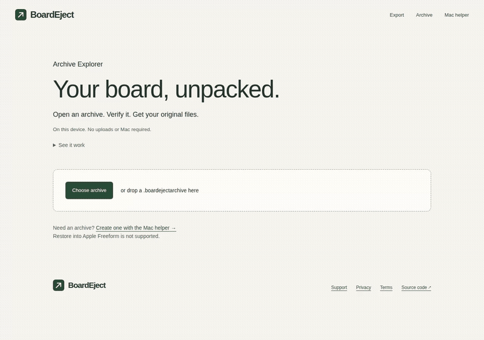

# BoardEject - Export Apple Freeform to Excalidraw

**Freeform to Excalidraw converter and verified local archive. Your board. Your format.**

Export Apple Freeform boards to editable Excalidraw files, or save a board as a verified local archive. Local-first with no account and no board uploads.

[Live site](https://boardeject.dev) · [Export](https://boardeject.dev/#export) · [Archive](https://boardeject.dev/#archive) · [Open archive](https://boardeject.dev/open) · [Mac helper](https://boardeject.dev/mac-helper) · [Test a capture](https://boardeject.dev/test-capture) · [Sample output](examples/example.excalidraw)


_Genuine Freeform 4.5 selection through the localhost Mac helper to editable Excalidraw text. [Watch MP4](docs/demo.mp4) · [MIT license](LICENSE)_

- **Keep editing:** supported shapes, text, tables, ink, and connectors become movable and editable Excalidraw elements.
- **Stay private:** conversion runs in your browser. No account, board uploads, or cloud storage.
- **Know what transferred:** review converted, partial, and unsupported items before downloading.

Keep your original board. Only a verified Freeform 4.5 subset is supported. See [Status](#status) before importing real work.

## How it works

### Editable export

1. Copy objects in Apple Freeform.
2. Click **Import copied selection** on BoardEject. The Mac helper reads one clipboard snapshot after this click.
3. Review the conversion report and preview.
4. Download the `.excalidraw` file.

No Mac handy? Use **Try example board** on the site, or test an existing `.boardeject` file in the [Capture Tester](https://boardeject.dev/test-capture).

### Local archive

1. Open BoardEject with the helper running and click **Scan Freeform**.
2. Choose a board and click **Create local archive**.
3. Save the `.boardejectarchive` file.
4. Click **Verify now** to check assets, hashes, and integrity.

The archive contains only the selected board with original assets and verification metadata. It never modifies the live Freeform database. Restore into Freeform is not supported. Details: [guide](docs/guide.md) and [archive format](docs/archive-format.md).

### Explore an archive



_Real archive from Freeform 4.5. [Watch MP4](docs/explorer-demo.mp4). No helper is needed to inspect this saved archive._

1. Open [Archive Explorer](https://boardeject.dev/open) and choose your `.boardejectarchive`.
2. Review integrity checks, board details, and missing-file warnings.
3. Preview supported original media and download individual files or a ZIP of the originals.

No Mac or helper needed to open an existing archive. After the page loads, inspection works offline until you close or refresh it. Included board previews and Excalidraw files are available only when the archive contains them; Explorer does not reconstruct a board from database records. Browser inspection is limited to 256 MiB compressed and expanded, and 10,000 ZIP entries. Hashes verify integrity, not authorship.

## Status

Verified scope for v0.0.5:

- Supported: shapes, text, tables, images with mask/shadow subset, ink, two-shape connectors, and nested-group subset from genuine Freeform 4.5 captures.
- Not supported: arbitrary version-7 boards, PDF input, restore or write-back, iCloud edits, table merge/rotation, exact fonts and mixed-style rendering.
- iPad Pencil pressure and erased-ink round trips remain unverified in [#20](https://github.com/royalpinto007/boardeject/issues/20).
- Mac helper is ad-hoc signed, not Apple-notarized. One-time Gatekeeper approval is required. See [guide](docs/guide.md#install-the-mac-helper).

Full boundaries and evidence: [fidelity report](docs/fidelity.md). Privacy: [Privacy](https://boardeject.dev/privacy) · [Terms](https://boardeject.dev/terms).

## Run locally

Requires Node 22.12 or newer.

```sh
npm ci
npm run dev
```

Open http://127.0.0.1:5190 and choose **Try example board**.

Checks:

```sh
npm run format:check
npm run lint
npm run typecheck
npm test
npm run build
```

## Contributing

[Open issues](https://github.com/royalpinto007/boardeject/issues) · [Buy me a coffee](https://www.buymeacoffee.com/royalpinto007)

Read [CONTRIBUTING.md](CONTRIBUTING.md) and [SECURITY.md](SECURITY.md). Built on [libfreeform](https://github.com/can1357/libfreeform) and [Excalidraw](https://github.com/excalidraw/excalidraw). Independent of Apple and Excalidraw.
